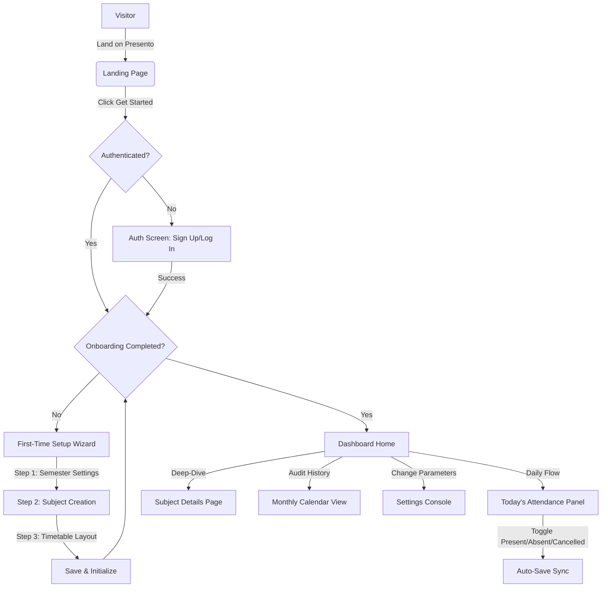

# Product Requirements Document (PRD): Presento

## Document Metadata
- **Product Name:** Presento
- **Version:** 1.0.0
- **Status:** Approved
- **Author:** Product Management & System Architecture Group
- **Target Release:** Q3 2026
- **Last Updated:** 2026-07-29

---

## 1. Product Overview

### 1.1 Product Vision
Presento is the ultimate companion for college students navigating rigid academic attendance policies. By providing lecture-level tracking, real-time analytics, and a predictive mathematical engine, Presento transforms attendance from an administrative source of anxiety into an optimized, predictable resource. The product's core philosophy is to empower students with data transparency: knowing exactly where they stand, how to maintain their required academic standing, and how to utilize their "bunk allowance" strategically for personal projects, health, internships, or extracurricular growth.

### 1.2 Problem Statement
Rigid attendance requirements (typically 75% or 85%) are enforced globally across universities. However, students struggle with several problems:
1. **Lack of Visibility:** Most university management systems (LMS) are slow, non-responsive, or updated late by professors. Students rarely know their real-time attendance status.
2. **Mental Math Friction:** Manually calculating how many classes can be safely skipped or how many consecutive classes must be attended to recover from an illness is tedious and error-prone.
3. **Complex Timetables:** Static calculations fail to account for varying weekly frequencies, alternating lecture types (Theory vs. Practicals), or unexpected class cancellations.
4. **No Proactive Alerting:** Students only find out they are below the threshold when it is too late, leading to exam debarment.

### 1.3 Solution
Presento is a highly responsive, mobile-first SaaS dashboard that acts as a personalized attendance ledger. 
- It maps the user's precise weekly timetable (supporting theory and practical slots).
- It provides a one-tap attendance logging interface optimized for rapid daily execution.
- It features the **Intelligent Bunk Calculator**, which uses real-time class frequencies to calculate exact "Safe Bunks" and "Required Attendances."
- It delivers granular, subject-level visual breakdowns and monthly calendar logs to maintain historical integrity.

### 1.4 Goals (Scope of v1)
- Seamless Google Sign-In and email/password authentication.
- Interactive onboarding to define semester boundaries, target requirements, and subject lists.
- Weekly timetable editor with multiple slots per day and drag-and-drop subject assignment.
- Daily attendance logging (Present, Absent, Cancelled) with automatic database sync.
- Dynamic dashboard featuring overall, type-specific, and subject-wise metrics.
- Comprehensive Bunk Calculator using exact integer-based threshold formulas.
- Full interactive calendar for historic edits and retro-active logging.
- Fully responsive, accessible, high-performance UI utilizing modern design principles.

### 1.5 Non-Goals (Out of Scope for v1)
- Automated scraping or API integration with third-party university portals (e.g., Moodle, Banner) due to proprietary firewalls and lack of open APIs.
- Grade or GPA tracking (reserved for v2).
- Social sharing or classroom groups (reserved for v2/v3).
- Real-time location-based automation (geofencing) for marking attendance.

### 1.6 Success Metrics
- **Activation Rate:** 85% of registered users successfully complete onboarding and establish a timetable within 24 hours of registration.
- **Daily Engagement:** A Daily Active Users to Monthly Active Users (DAU/MAU) ratio of >45% during active academic terms.
- **Logging Speed:** Average time to log a daily schedule of less than 10 seconds.
- **Retention Rate:** 70% weekly retention rate throughout the first academic semester.

---

## 2. Target Audience & User Personas

### 2.1 Target Audience
- **Primary:** Full-time undergraduate and postgraduate college students (ages 18–25) subject to strict, mandatory attendance policies (e.g., engineering, medical, law, and business schools).
- **Secondary:** Part-time students, professional certification candidates, or parents seeking an independent tracker to verify their child's academic attendance.

### 2.2 User Personas

#### Persona A: "The Hustler" (Aarav Patel)
- **Profile:** 20-year-old CS undergraduate who freelances and builds startups.
- **Needs:** Aarav needs to skip lectures to attend client meetings, developer hackathons, and deep-work sessions. 
- **Pain Point:** He lives in constant fear of dropping below 75% in any subject and being barred from final exams, which would ruin his academic status.
- **Goal:** Wants to know exactly which classes he can skip today to free up a 4-hour block, and what his safety margin is.

#### Persona B: "The Club Leader" (Priya Sharma)
- **Profile:** 21-year-old Liberal Arts student, head of the university cultural committee.
- **Needs:** Priya travels frequently for inter-college festivals, debates, and rehearsals.
- **Pain Point:** Her schedule changes weekly. She needs to coordinate multiple partial-day absences and map them against holidays and cancelled lectures.
- **Goal:** Wants a dynamic dashboard that adapts to class cancellations and displays how many future classes she must attend to offset her travel weeks.

#### Persona C: "The Commuter Student" (Dev Mukherji)
- **Profile:** 19-year-old commerce student commuting 1.5 hours daily.
- **Needs:** Dev frequently misses the 8:30 AM lecture due to train delays. 
- **Pain Point:** Keeping track of dynamic morning absences on a paper notepad or notes app is disorganized.
- **Goal:** Needs a mobile-first, one-tap logger that he can open on the train to mark his morning status.

---

## 3. Complete User Journey

The diagram below outlines the primary user flow from landing page to daily logging:



### 3.1 Step-by-Step Walkthrough
1. **Landing & Discovery:** A user arrives at the landing page, showcasing high-fidelity interactive mockups of the bunk calculator.
2. **Authentication:** The user clicks "Get Started" and is redirected to a clean Auth page offering Google Sign-in or standard Email/Password verification.
3. **Onboarding Setup Wizard:**
   - **Step 1:** The user inputs their semester name, start/end dates, and required attendance percentage (e.g., 75%).
   - **Step 2:** They create subjects by adding a name, code (optional), and designating each as Theory or Practical.
   - **Step 3:** The user fills in their weekly timetable (Monday to Saturday) by mapping subjects to specific time slots.
4. **Daily Active Usage:**
   - Upon logging in, the app detects the current day and highlights "Today's Agenda" on the Dashboard.
   - The user views their lectures for the day, marked "Present" by default. They can toggle individual lectures to "Absent" or "Cancelled," or click a master button to mark the entire day absent.
   - Database synchronization occurs automatically in the background with visual confirmation indicators.
5. **Analytics & Bunk Calculations:**
   - The user interacts with the **Bunk Calculator** card on the dashboard to check overall and subject-level allowances.
   - For subjects falling short of the threshold, the card turns red and displays: *"Must attend the next N lectures to recover."*
   - For healthy subjects, it displays: *"Safe to bunk the next B lectures."*
6. **Maintenance & Edits:**
   - When a professor retroactively reschedules a lecture, the user opens the **Calendar** view, navigates to the date, and modifies that day's attendance log.
   - The dashboard instantly updates all aggregates and trendlines.

---

## 4. Authentication

Presento requires a robust, secure authentication system that supports both frictionless social login and traditional credentials.

| Feature | Technical Implementation | Error Handling & UX |
| :--- | :--- | :--- |
| **Google Sign-In** | OAuth 2.0 via Google Identity Services. Exchanges auth code for JWT/session token on backend. | If OAuth fails, redirect back to login page with a Toast alert showing the specific failure. |
| **Email & Password** | Traditional signup with email verification. Passwords must be hashed using bcrypt (cost factor: 12). | Standard validations: Email must be unique, password must contain min 8 characters, 1 number, 1 special character. |
| **Session Management** | HTTP-only, secure, SameSite=Strict cookies containing a signed JWT. Expiration set to 7 days for active sessions. | Silent token refresh in background. If session expires, redirect to login page with `?expired=true` query. |
| **Forgot Password** | Cryptographically secure token (SHA-256) sent to verified email. Link valid for 15 minutes. | User error displays: "If this email exists, a reset link has been sent." to prevent account enumeration. |
| **Logout** | Revokes JWT refresh tokens on the database, clears the HTTP-only cookie, and invalidates client cache. | Clear all client-side state variables (Zustand/Redux) and redirect to the landing page. |

---

## 5. First-Time Setup (Onboarding Wizard)

The onboarding flow must be cohesive and validation-strict to ensure the core data models are configured properly.

```
Onboarding Wizard:
[ Step 1: Semester Settings ] ---> [ Step 2: Subject Management ] ---> [ Step 3: Timetable Layout ]
```

### 5.1 Step 1: Semester Details
The user establishes the core boundaries of the academic period.
- **Semester Name:** (e.g., "Fall Semester 2026"). String, max 50 characters.
- **Start Date:** Date picker (ISO date string). Must be prior to End Date.
- **End Date:** Date picker (ISO date string). Must be after Start Date. Max duration limited to 1 year.
- **Required Attendance (%):** Numeric input (range: 50% to 100%). Defaults to **75%**. Includes a custom slider.
- **Holidays:** Multi-date selector to mark known institutional holidays (automatically populated dynamically later).

### 5.2 Step 2: Subject Creation
Users define their current course load.
- **Subject Grid:** Dynamic row addition.
- **Attributes:**
  - *Name:* (e.g., "Database Management Systems"). Required.
  - *Subject Code:* (e.g., "CS-302"). Optional.
  - *Category:* Radio button toggle: `Theory` or `Practical`.
- **Validation:** Minimum of 1 subject must be created to proceed. Maximum limit of 15 subjects per semester.

### 5.3 Step 3: Timetable Configuration
An interactive weekly grid mapping subjects to time-bound slots.
- **Day Selector:** Monday to Saturday tabs.
- **Lecture Slot Creator:**
  - Clicking "Add Lecture" spawns a modal requiring:
    - *Subject:* Dropdown list populated from Step 2.
    - *Start Time:* Time picker (24-hour format).
    - *End Time:* Time picker (must be after Start Time).
- **Interactive Assign Options:**
  - *Template Loading:* Dropdown to load standard college templates (e.g., "5-day standard 9-5", "6-day morning batch").
  - *Click-to-Assign:* Users click an empty block in a weekly timeline layout, select the subject from a floating radial menu, and confirm timing.
- **Integrity Constraints:** Prevents overlapping lecture times for the same day.

---

## 6. Subject Management

Subjects are the central node of the Presento data model. The UI must provide a dedicated console for subject maintenance.

### 6.1 Fields and Validations
- **Subject ID:** UUIDv4 (auto-generated, primary key).
- **Subject Name:** String (1 to 100 characters). HTML tags sanitized.
- **Subject Code:** String (max 15 characters, alphanumeric, uppercase enforced, e.g., `MATH201`).
- **Lecture Type:** Enumerated value: `THEORY` or `PRACTICAL`.
- **Minimum Target:** Numeric override (defaults to the semester's default percentage, but can be customized per subject).

### 6.2 Operations

#### Add Subject
Spawns a slide-out side panel (drawer) to input fields. On save, app verifies uniqueness of the name/code combo.

#### Edit Subject
Allows updating the Name, Code, and target percentage. Changing the `Type` (Theory to Practical) after attendance has been logged triggers a warning modal:
> **[WARNING] Changing Lecture Type:** Changing this subject from Theory to Practical will modify your dashboard breakdowns. Historical logs will be preserved but classified under the new type. Do you wish to proceed?

#### Delete Subject
To prevent accidental data loss, deleting a subject requires a strict verification confirmation. The user must type the name of the subject into a confirmation input box.
- **Soft vs Hard Delete:** A "Delete" performs a cascading hard delete of all corresponding attendance records and timetable slots from the database.
- **Archiving Alternative:** Users can toggle a subject to "Archived." This hides it from active timetables and today's logging, but keeps historical metrics intact in reports.

---

## 7. Timetable System

The timetable system maps weekly recurring schedules. It is structured around weekly loops (Monday through Saturday).

### 7.1 Timetable Rules
- **Weekly Range:** Monday, Tuesday, Wednesday, Thursday, Friday, Saturday. Sunday is excluded from standard academic schedules (but can be enabled in settings if a regional market requires it).
- **Timing Slots:** Supports arbitrary start and end times, allowing variable durations (e.g., 50-minute lectures, 2-hour practical labs).
- **Lecture Capacity:** Up to 10 lectures can be mapped per day.
- **Overlap Prevention Algorithm:** When adding a new slot, the system executes a client-side and backend overlap check:
  $$\text{NewSlot.StartTime} < \text{ExistingSlot.EndTime} \quad \text{AND} \quad \text{NewSlot.EndTime} > \text{ExistingSlot.StartTime}$$
  If this evaluates to true, an error toast is fired: *"Conflict detected with [Subject Name] ([Time Range])."*

### 7.2 Timetable Management Interface

#### The Grid Editor
A desktop-optimized matrix layout where columns represent Days (Mon-Sat) and rows represent hour slots. Mobile collapses this view to a swipeable day-card stack.

```
Desktop Timetable Grid Layout:
+------------+--------------------+--------------------+--------------------+
| Time Slot  | Monday             | Tuesday            | Wednesday          |
+------------+--------------------+--------------------+--------------------+
| 09:00-10:00| CS-101 (Theory)    | MATH-201 (Theory)  | CS-101 (Theory)    |
+------------+--------------------+--------------------+--------------------+
| 10:00-11:00| MECH-102 (Theory)  | [ Add Lecture + ]  | MECH-102 (Theory)  |
+------------+--------------------+--------------------+--------------------+
| 11:15-13:15| [ Practical Lab ]  | CS-101 (Theory)    | [ Practical Lab ]  |
+------------+--------------------+--------------------+--------------------+
```

#### Drag-and-Drop Assignment
- Left Sidebar displays a list of the user's created subjects as draggable badges.
- The main canvas displays the timetable grid.
- Dropping a subject badge onto a day cell opens a quick-config popup pre-filled with the target day, prompting only for Start and End times.

#### Slot Operations
- **Delete Slot:** Hovering over a timetable cell displays a delete icon (`×`). Clicking it removes the recurring slot. Active and future attendance calculations adapt immediately; historical attendance logs remain unchanged.
- **Add Special Event:** Allows injecting a one-time class or rescheduling a specific slot for a singular date without altering the weekly template.

---

## 8. Attendance System

The daily attendance flow is the primary interaction point of the application and must remain simple and high-performance.

### 8.1 Active Daily Agenda Loop
1. The backend cron job (running at 00:00 UTC) evaluates the active semester timeline, checking if the current date is a marked holiday.
2. If it is a normal academic day, the system queries the `TimetableSlots` table for the current weekday and creates placeholder entries in the `AttendanceLogs` table for each scheduled lecture.
3. **Default State:** To avoid manual overhead, lectures can be configured to default to **Present** or **Unmarked**. In Presento, the default is set to **Unmarked**. The UI displays cards with options for `Present` (Green check), `Absent` (Red cross), and `Cancelled` (Amber dash).

### 8.2 Attendance Controls & Actions
- **Mark Present:** One-tap. Sets status to `PRESENT`. Increments numerator ($P$) and denominator ($T$).
- **Mark Absent:** One-tap. Sets status to `ABSENT`. Keeps numerator constant, increments denominator ($T$).
- **Mark Cancelled:** One-tap. Sets status to `CANCELLED`. Occurs when a professor is absent. Does not increment numerator or denominator. Does not penalize the student.
- **Mark Day Absent:** A top-level toggle switch. Instantly marks all scheduled lectures for that day as `ABSENT`. Handy for sick days.
- **Mark Day Cancelled:** A top-level switch to clear the day's records if the college declares an unplanned holiday.

### 8.3 Technical Implementation details
- **Auto-Save Engine:** State changes trigger a debounced (500ms) background API request (`PATCH /api/attendance/log`). The UI displays a spinning loop icon that resolves to a green checkmark stating "All changes saved."
- **Historical Editing:** A date picker allows users to navigate to any past day. The system fetches the logs for that date. The user can toggle statuses, and the system recalculates attendance stats recursively from that point forward.

### 8.4 Edge Cases & Resolutions
- **Timetable Edited Mid-Semester:**
  *Problem:* If a user changes their Wednesday 10 AM class from Subject A to Subject B, what happens to historical logs?
  *Solution:* Historical records must remain intact. Attendance logs store a copy of the subject details (`subject_id`) and timing directly in the log table, completely decoupling past logs from changes made to the recurring template.
- **Double Lectures:**
  *Problem:* Two identical lectures of the same subject occur back-to-back.
  *Solution:* The system treats them as two discrete entries in the database (e.g., Slot 1: 09:00–10:00, Slot 2: 10:00–11:00) allowing the user to be present for one and absent/tardy for the other.

---

## 9. Dashboard

The Dashboard is the home screen of the application. It uses a premium dark-mode, glassmorphism design with a modular bento grid structure.

```
+------------------------------------------------------------------------+
|  [Header: Greeting, Real-Time Date]                 [Settings Control] |
+------------------------------------+-----------------------------------+
|                                    |                                   |
|  Overall Attendance Radial Ring    |  Today's Attendance Panel         |
|  [ 78.4% ]                         |  - CS-101 (09:00 AM)  [P] [A] [C] |
|  Status: Safe (+2 Bunks)           |  - MATH-201 (10:00 AM)[P] [A] [C] |
|                                    |  - MECH-102 (11:15 AM)[P] [A] [C] |
|                                    |                                   |
+------------------------------------+-----------------------------------+
|                                                                        |
|  Weekly/Monthly Trend Chart (Bar/Line graph of logs vs target)         |
|                                                                        |
+------------------------------------------------------------------------+
|  Subject Cards Grid (Bento Box Layout)                                 |
|  +--------------------+ +--------------------+ +--------------------+  |
|  | CS-101 (Theory)    | | MATH-201 (Theory)  | | PHY-103 (Lab)      |  |
|  | [|||||||||   ] 72% | | [||||||||||||] 85% | | [||||||||||| ] 78% |  |
|  | Must attend next 2 | | Safe to bunk 3     | | Safe to bunk 1     |  |
|  +--------------------+ +--------------------+ +--------------------+  |
+------------------------------------------------------------------------+
```

### 9.1 Dashboard Widgets

#### A. Overall Attendance Progress Ring
- A large SVG-rendered circular progress bar in the center of the main bento card.
- **Dynamic Color States:**
  - *Green:* Attendance $\ge$ Target % + 5% (e.g., $\ge 80\%$)
  - *Yellow/Orange:* Target % $>$ Attendance $\ge$ Target % - 5% (e.g., $70\% - 74.9\%$)
  - *Red:* Attendance $<$ Target % - 5% (e.g., $< 70\%$)
- Displays the target line as a dotted radial marker on the ring.

#### B. Today's Agenda Panel
- Lists today's scheduled lectures sequentially based on the active timetable.
- Status buttons (`P`, `A`, `C`) scale up slightly (`scale-105`) and emit active colors when selected.
- Progress bar displaying percentage of logged classes for today.

#### C. Type Breakdown Cards
- **Theory Attendance:** Small circular progress widget tracking lectures of type `THEORY`.
- **Practical Attendance:** Small circular progress widget tracking lectures of type `PRACTICAL`.

#### D. Interactive Trend Charts
- **Weekly Trend:** A bar chart showing the net percentage change over the last 7 days.
- **Monthly Trend:** A smooth bezier line chart displaying the user's progress toward the target percentage over the course of the semester.

#### E. Subject Cards Grid
- Bento box layout of individual cards for each subject.
- Displays subject name, current percentage, a linear progress bar, and immediate actions.
- Displays helper tags, e.g., "Safe to Bunk: 2" (Green badge) or "Attend next: 3" (Crimson alert badge).

---

## 10. Subject Details Page

Clicking a subject card on the dashboard navigates the user to a detailed analytical page.

### 10.1 Key Metrics Bar
- **Total Lectures:** Total scheduled classes conducted (excludes cancelled ones).
- **Present Count:** Total classes marked Present.
- **Absent Count:** Total classes marked Absent.
- **Cancelled Count:** Total classes marked Cancelled.
- **Attendance Percentage:** Displayed out to two decimal places (e.g., `76.47%`).

### 10.2 Historical Log Table
- A chronologically ordered table listing every date this lecture was logged.
- Columns: `Date`, `Time Slot`, `Status`, `Actions`.
- **Inline Editing:** Clicking the status badge opens a dropdown menu to change the status directly in the row. On change, the calculations at the top of the page animate and update instantly.

### 10.3 Analytical Graphs
- **Absence Log Distribution:** A calendar heat-map (similar to GitHub's contribution graph) showing days of high absenteeism for that specific subject. Helps students detect pattern-based behaviors (e.g., "You miss 60% of Friday lectures").

---

## 11. Bunk Calculator

The Bunk Calculator is the core logic module of Presento. It uses precise, discrete integer calculations to determine the exact number of classes a user can safely miss or must attend to reach their target.

### 11.1 Mathematical Formulation

Let:
- $P$ = Cumulative lectures marked **Present**.
- $A$ = Cumulative lectures marked **Absent**.
- $T$ = Cumulative lectures conducted ($T = P + A$). Note: Cancelled classes do not alter these values.
- $R$ = Minimum required attendance percentage expressed as a decimal (e.g., $75\% \implies R = 0.75$).
- $C_{curr}$ = Current attendance ratio ($C_{curr} = \frac{P}{T}$).

---

### 11.2 Calculations

```
           +---------------------------------+
           |      Evaluate Current %         |
           +---------------------------------+
                            |
             Is Current % >= Required % ?
             /                             \
           YES                              NO
           /                                 \
  +-------------------------+       +----------------------------+
  |  Calculate Safe Bunks   |       | Calculate Required Attend  |
  |  Formula:               |       | Formula:                   |
  |  B = floor((P - R*T)/R) |       | N = ceil((R*T - P)/(1 - R))|
  +-------------------------+       +----------------------------+
```

#### Scenario A: Current Attendance is Above or Equal to Target ($C_{curr} \ge R$)
We need to calculate the maximum number of consecutive future lectures ($B$) the student can miss (bunk) without dropping below the target $R$.

The inequality to satisfy is:
$$\frac{P}{T + B} \ge R$$

Solving for $B$:
$$P \ge R(T + B)$$
$$P \ge R \cdot T + R \cdot B$$
$$R \cdot B \le P - R \cdot T$$
$$B \le \frac{P - R \cdot T}{R}$$

Since $B$ must be a whole number of lectures, we take the floor of this expression to get the maximum safe bunks ($B_{max}$):
$$B_{max} = \lfloor \frac{P - R \cdot T}{R} \rfloor$$

##### Example Walkthrough:
- *Current Stats:* Present ($P$) = 15, Absent ($A$) = 1, Total ($T$) = 16. Current attendance = 93.75%.
- *Target ($R$):* 75% ($0.75$).
- *Calculation:*
  $$B_{max} = \lfloor \frac{15 - (0.75 \times 16)}{0.75} \rfloor = \lfloor \frac{15 - 12}{0.75} \rfloor = \lfloor \frac{3}{0.75} \rfloor = 4 \text{ lectures}$$
- *Verification:*
  - If we bunk 4 lectures: $P = 15$, new total = $16 + 4 = 20$. Attendance = $15 / 20 = 75\%$ (Safe).
  - If we bunk 5 lectures: $P = 15$, new total = $16 + 5 = 21$. Attendance = $15 / 21 = 71.4\%$ (Below target).
  - The formula holds true.

---

#### Scenario B: Current Attendance is Below Target ($C_{curr} < R$)
We need to calculate the minimum number of consecutive future lectures ($N$) the student must attend in order to reach the target $R$.

The inequality to satisfy is:
$$\frac{P + N}{T + N} \ge R$$

Solving for $N$:
$$P + N \ge R(T + N)$$
$$P + N \ge R \cdot T + R \cdot N$$
$$N - R \cdot N \ge R \cdot T - P$$
$$N(1 - R) \ge R \cdot T - P$$
$$N \ge \frac{R \cdot T - P}{1 - R}$$

Since $N$ must be a whole number of lectures, we take the ceiling of this expression to get the minimum required lectures ($N_{req}$):
$$N_{req} = \lceil \frac{R \cdot T - P}{1 - R} \rceil$$

##### Example Walkthrough:
- *Current Stats:* Present ($P$) = 6, Absent ($A$) = 4, Total ($T$) = 10. Current attendance = 60%.
- *Target ($R$):* 75% ($0.75$).
- *Calculation:*
  $$N_{req} = \lceil \frac{(0.75 \times 10) - 6}{1 - 0.75} \rceil = \lceil \frac{7.5 - 6}{0.25} \rceil = \lceil \frac{1.5}{0.25} \rceil = 6 \text{ lectures}$$
- *Verification:*
  - If we attend 5 lectures: $P = 6 + 5 = 11$, new total = $10 + 5 = 15$. Attendance = $11 / 15 = 73.3\%$ (Below target).
  - If we attend 6 lectures: $P = 6 + 6 = 12$, new total = $10 + 6 = 16$. Attendance = $12 / 16 = 75\%$ (Safe).
  - The formula holds true.

---

### 11.3 Timetable-Aware Predictive Timeline
Rather than displaying a raw number (e.g., "Safe to bunk 3 lectures"), Presento translates this value using the user's active timetable layout:
- If Subject A has 3 lectures scheduled per week (Monday, Wednesday, Friday) and the student has **3 safe bunks**:
  - The system displays: *"You can safely bunk all lectures of this subject until [Date of Friday's lecture]."*
- If the student needs to attend **5 lectures** to recover, and has 2 lectures per week:
  - The system displays: *"You must attend every lecture of this subject until [Date of class 3 weeks from now]."*

---

## 12. Calendar View

The Calendar provides an interactive monthly overview of attendance history.

```
Monthly Calendar Grid Concept:
+--------------------------------------------------+
|  <  July 2026                                 >  |
+----+----+----+----+----+----+--------------------+
| Su | Mo | Tu | We | Th | Fr | Sa                 |
+----+----+----+----+----+----+--------------------+
|    |    | 1  | 2  | 3  | 4  | 5                  |
|    |    | [P]| [P]| [C]| [A]| [H]                |
+----+----+----+----+----+----+--------------------+
| 6  | 7  | 8  | 9  | 10 | 11 | 12                 |
| [P]| [P]| [P]| [P]| [P]| [P]| [P]                |
+----+----+----+----+----+----+--------------------+
```

### 12.1 Visual States of Calendar Days
Each day block displays the numeric date alongside a color-coded status bar representing the aggregate state of that day:
- **Full Attendance (Emerald):** All scheduled lectures were marked `PRESENT`.
- **Partial Attendance (Amber):** At least one lecture was marked `PRESENT`, and at least one was marked `ABSENT`.
- **Full Absence (Rose):** All scheduled lectures were marked `ABSENT`.
- **All Cancelled (Slate):** All scheduled classes were cancelled.
- **Holiday (Blue):** The date is marked as an institutional or national holiday.
- **Unmarked (Dotted Outline):** Active academic day but no logs recorded.

### 12.2 Calendar Interactions
- **Day Click:** Clicking any day block opens a slide-over modal detailing the lectures held.
- **Log Override Panel:** Within the modal, the user can toggle the logged status of any individual lecture or click "Mark Day as Holiday." Saving automatically triggers the calculation update pipeline and synchronizes changes to the backend.

---

## 13. Settings

The Settings module allows users to configure preferences and manage their data.

- **Semester Configuration:**
  - Edit Semester Name, Start/End dates.
  - Set default holidays.
  - *Data Recalculation Alert:* Modifying semester bounds recalculates all attendance history and truncates logs falling outside the new date range.
- **Attendance Settings:**
  - Adjust target attendance percentage (global or subject-specific).
  - Configure default logging states: `Unmarked` or `Present`.
- **Appearance & Accessibility:**
  - Theme Selection: `System Default`, `OLED Dark Mode`, `Refined Light Mode`.
  - Contrast overrides.
- **Data Portability:**
  - **Export Data:** Generates a zip package containing the user's data in a clean `JSON` file and key tables in `.csv` formats.
  - **Delete Account:** Deletes the user profile, credentials, active sessions, and all associated subjects and attendance logs permanently. Requires password confirmation.

---

## 14. Database Design

We recommend a highly normalized PostgreSQL relational database schema to ensure relational integrity, historical logs auditability, and performant aggregate queries.

### 14.1 Entity-Relationship Diagram (ERD)

```
  +--------------+          +-----------------+          +------------------+
  |    USERS     | 1      * |    SEMESTERS    | 1      * |     SUBJECTS     |
  |--------------|----------|-----------------|----------|------------------|
  | user_id (PK) |          | semester_id (PK)|          | subject_id (PK)  |
  | email        |          | user_id (FK)    |          | semester_id (FK) |
  | pass_hash    |          | name            |          | name             |
  +--------------+          | start_date      |          | code             |
                            | end_date        |          | type (enum)      |
                            +-----------------+          +------------------+
                                     |                             |
                                     | 1                           | 1
                                     |                             |
                                     | *                           | *
                            +-----------------+          +------------------+
                            |    HOLIDAYS     |          | TIMETABLE_SLOTS  |
                            |-----------------|          |------------------|
                            | holiday_id (PK) |          | slot_id (PK)     |
                            | semester_id (FK)|          | subject_id (FK)  |
                            | date            |          | day_of_week      |
                            | name            |          | start_time       |
                            +-----------------+          | end_time         |
                                                         +------------------+
                                                                   |
                                                                   | 1
                                                                   |
                                                                   | *
                                                         +------------------+
                                                         | ATTENDANCE_LOGS  |
                                                         |------------------|
                                                         | log_id (PK)      |
                                                         | subject_id (FK)  |
                                                         | slot_id (FK, opt)|
                                                         | date             |
                                                         | status (enum)    |
                                                         +------------------+
```

---

### 14.2 Database Table Schemas

#### 1. USERS
Stores core user profiles.

| Column Name | Data Type | Constraints | Description |
| :--- | :--- | :--- | :--- |
| `user_id` | UUID | PK, Default: `uuid_generate_v4()` | Unique identifier. |
| `email` | VARCHAR(255) | UNIQUE, NOT NULL | User's email address. |
| `password_hash`| VARCHAR(255) | NOT NULL | Bcrypt hash of password. |
| `created_at` | TIMESTAMP | DEFAULT: `CURRENT_TIMESTAMP` | Signup timestamp. |
| `updated_at` | TIMESTAMP | DEFAULT: `CURRENT_TIMESTAMP` | Last profile update. |

#### 2. SEMESTERS
Defines academic terms.

| Column Name | Data Type | Constraints | Description |
| :--- | :--- | :--- | :--- |
| `semester_id` | UUID | PK, Default: `uuid_generate_v4()` | Unique identifier. |
| `user_id` | UUID | FK -> `USERS(user_id)` ON DELETE CASCADE | Owner of the semester. |
| `name` | VARCHAR(100) | NOT NULL | e.g., "Fall 2026". |
| `start_date` | DATE | NOT NULL | Semester start date. |
| `end_date` | DATE | NOT NULL | Semester end date. |
| `target_pct` | NUMERIC(5,2) | NOT NULL, DEFAULT: 75.00 | Attendance target (e.g., 75.00). |

#### 3. SUBJECTS
Courses tracked inside a semester.

| Column Name | Data Type | Constraints | Description |
| :--- | :--- | :--- | :--- |
| `subject_id` | UUID | PK, Default: `uuid_generate_v4()` | Unique identifier. |
| `semester_id` | UUID | FK -> `SEMESTERS(semester_id)` ON DELETE CASCADE | Associated semester. |
| `name` | VARCHAR(150) | NOT NULL | Subject name. |
| `code` | VARCHAR(20) | NULL | Subject code. |
| `type` | VARCHAR(20) | CHECK (`type` IN ('THEORY', 'PRACTICAL')) | Lecture style. |
| `target_pct` | NUMERIC(5,2) | NULL | Subject-specific override. |

#### 4. TIMETABLE_SLOTS
Defines the weekly class timetable template.

| Column Name | Data Type | Constraints | Description |
| :--- | :--- | :--- | :--- |
| `slot_id` | UUID | PK, Default: `uuid_generate_v4()` | Unique identifier. |
| `subject_id` | UUID | FK -> `SUBJECTS(subject_id)` ON DELETE CASCADE | Associated subject. |
| `day_of_week` | INT | CHECK (`day_of_week` BETWEEN 1 AND 6) | 1=Monday, 6=Saturday. |
| `start_time` | TIME | NOT NULL | Start time of class. |
| `end_time` | TIME | NOT NULL | End time of class. |

#### 5. ATTENDANCE_LOGS
Ledger recording daily class attendance.

| Column Name | Data Type | Constraints | Description |
| :--- | :--- | :--- | :--- |
| `log_id` | UUID | PK, Default: `uuid_generate_v4()` | Unique identifier. |
| `subject_id` | UUID | FK -> `SUBJECTS(subject_id)` ON DELETE CASCADE | Associated subject. |
| `slot_id` | UUID | FK -> `TIMETABLE_SLOTS(slot_id)` ON DELETE SET NULL | Reference to slot template. |
| `date` | DATE | NOT NULL | Calendar date of class. |
| `status` | VARCHAR(20) | CHECK (`status` IN ('PRESENT', 'ABSENT', 'CANCELLED')) | Attendance status. |
| `updated_at` | TIMESTAMP | DEFAULT: `CURRENT_TIMESTAMP` | Log audit timestamp. |

#### 6. HOLIDAYS
Calendar dates where classes are suspended.

| Column Name | Data Type | Constraints | Description |
| :--- | :--- | :--- | :--- |
| `holiday_id` | UUID | PK, Default: `uuid_generate_v4()` | Unique identifier. |
| `semester_id` | UUID | FK -> `SEMESTERS(semester_id)` ON DELETE CASCADE | Associated semester. |
| `date` | DATE | NOT NULL | Date of holiday. |
| `name` | VARCHAR(100) | NOT NULL | e.g., "Thanksgiving". |

---

### 14.3 Indexes for Query Optimization
To maintain rapid response times as logs grow over a semester, the following database indexes must be implemented:
1. `idx_semesters_user`: Index on `SEMESTERS(user_id)` to quickly load semester configurations for a logged-in user.
2. `idx_subjects_semester`: Index on `SUBJECTS(semester_id)` to load subjects rapidly on dashboard initialization.
3. `idx_timetable_subject`: Index on `TIMETABLE_SLOTS(subject_id)` for timetable rendering operations.
4. `idx_attendance_lookup`: Composite index on `ATTENDANCE_LOGS(subject_id, date)` to fetch date-restricted records rapidly.
5. `idx_attendance_date`: Index on `ATTENDANCE_LOGS(date)` to load daily dashboard details.

---

## 15. Backend Architecture & REST APIs

Presento's backend handles authentication, business logic calculations, and data transactions securely and performantly.

### 15.1 Component Structure

```
+--------------------------------------------------------------+
|                     REST API Layer (HTTP)                    |
+--------------------------------------------------------------+
                               |
                               v
+--------------------------------------------------------------+
|                    Business Validation Layer                 |
|             (Schema enforcement, JWT validation)             |
+--------------------------------------------------------------+
                               |
                               v
+--------------------------------------------------------------+
|                        Service Layer                         |
|         (Bunk calculations, Timetable conflict checks)       |
+--------------------------------------------------------------+
                               |
                               v
+--------------------------------------------------------------+
|                   Data Access Layer (ORM)                    |
+--------------------------------------------------------------+
                               |
                               v
+--------------------------------------------------------------+
|                      PostgreSQL Database                     |
+--------------------------------------------------------------+
```

---

### 15.2 Detailed REST API Endpoint Specifications

#### 1. Authentication Endpoints

##### `POST /api/auth/signup`
- **Description:** Registers a new user.
- **Request Headers:** `Content-Type: application/json`
- **Request Body:**
```json
{
  "email": "student@university.edu",
  "password": "SecurePassword123!"
}
```
- **Response (201 Created):**
```json
{
  "status": "success",
  "message": "User registered successfully. Verification email sent.",
  "data": {
    "user_id": "a9b8c7d6-e5f4-3210-abcd-ef0123456789",
    "email": "student@university.edu"
  }
}
```

##### `POST /api/auth/login`
- **Description:** Logs in an existing user and establishes session cookies.
- **Request Body:**
```json
{
  "email": "student@university.edu",
  "password": "SecurePassword123!"
}
```
- **Response (200 OK):**
```json
{
  "status": "success",
  "message": "Login successful."
}
```
*Note: Sets an HTTP-only, secure, SameSite=Strict cookie containing the JWT session token.*

---

#### 2. Timetable Endpoints

##### `GET /api/timetable`
- **Description:** Fetches the active weekly timetable.
- **Request Headers:** `Authorization: Bearer <token>` (or read from cookie context)
- **Response (200 OK):**
```json
{
  "status": "success",
  "data": {
    "timetable": {
      "1": [
        {
          "slot_id": "b1c2d3e4-f5a6-7890-bcde-f0123456789a",
          "subject_id": "c2d3e4f5-a6b7-8901-cdef-0123456789ab",
          "subject_name": "Database Management Systems",
          "start_time": "09:00:00",
          "end_time": "10:00:00"
        }
      ],
      "2": [],
      "3": [],
      "4": [],
      "5": [],
      "6": []
    }
  }
}
```

##### `POST /api/timetable/slots`
- **Description:** Adds a new lecture slot to the timetable.
- **Request Body:**
```json
{
  "subject_id": "c2d3e4f5-a6b7-8901-cdef-0123456789ab",
  "day_of_week": 1,
  "start_time": "09:00",
  "end_time": "10:00"
}
```
- **Response (201 Created):**
```json
{
  "status": "success",
  "data": {
    "slot_id": "b1c2d3e4-f5a6-7890-bcde-f0123456789a",
    "subject_id": "c2d3e4f5-a6b7-8901-cdef-0123456789ab",
    "day_of_week": 1,
    "start_time": "09:00:00",
    "end_time": "10:00:00"
  }
}
```
- **Response (409 Conflict):**
```json
{
  "status": "error",
  "code": "TIMETABLE_CONFLICT",
  "message": "Time slot overlaps with existing class: MATH-201 (08:30 - 09:30)"
}
```

---

#### 3. Attendance Endpoints

##### `GET /api/attendance/today`
- **Description:** Loads attendance details for the current date.
- **Response (200 OK):**
```json
{
  "status": "success",
  "data": {
    "date": "2026-07-29",
    "is_holiday": false,
    "holiday_name": null,
    "lectures": [
      {
        "log_id": "d4e5f6a7-b8c9-0123-def0-123456789abc",
        "subject_name": "Database Management Systems",
        "slot_id": "b1c2d3e4-f5a6-7890-bcde-f0123456789a",
        "start_time": "09:00:00",
        "end_time": "10:00:00",
        "status": "PRESENT"
      }
    ]
  }
}
```

##### `PATCH /api/attendance/log`
- **Description:** Updates the attendance status of a specific class log.
- **Request Body:**
```json
{
  "log_id": "d4e5f6a7-b8c9-0123-def0-123456789abc",
  "status": "ABSENT"
}
```
- **Response (200 OK):**
```json
{
  "status": "success",
  "message": "Attendance updated successfully.",
  "data": {
    "log_id": "d4e5f6a7-b8c9-0123-def0-123456789abc",
    "status": "ABSENT",
    "updated_at": "2026-07-29T16:53:10Z"
  }
}
```

---

## 16. Frontend Architecture & Folder Structure

We recommend a Next.js (using the App Router) framework paired with Zustand for lightweight client state management and React Query for asynchronous data caching and mutations.

### 16.1 Folder Structure

```
presento/
├── public/                 # Static assets (logos, icons)
├── src/
│   ├── app/                # Next.js App Router Pages
│   │   ├── layout.tsx      # Global app layout & provider wrapping
│   │   ├── page.tsx        # Public marketing landing page
│   │   ├── login/          # Auth Login Page
│   │   ├── signup/         # Auth Registration Page
│   │   ├── onboarding/     # Onboarding Setup Wizard
│   │   ├── dashboard/      # User Home Dashboard Screen
│   │   ├── subjects/       # Subject Details and Management
│   │   └── calendar/       # Monthly Calendar Log Manager
│   ├── components/         # Reusable UI Elements (Atomic Design)
│   │   ├── ui/             # Core primitives (Button, Input, Card)
│   │   ├── charts/         # Dashboard analytics charts (Recharts)
│   │   └── shared/         # Sidebar, Navbar, Mobile Footer
│   ├── hooks/              # Custom React Hooks
│   │   ├── useAttendance.ts# Queries for attendance updates
│   │   └── useBunkCalc.ts  # Client-side calculator hook
│   ├── store/              # Zustand global state stores
│   │   ├── useAuthStore.ts # Cache credentials & session state
│   │   └── useUiStore.ts   # Sidebar, theme, modal states
│   └── utils/              # Helper functions & constants
│       ├── formulas.ts     # Attendance calculation algorithms
│       └── formatters.ts   # Date and string formatter utilities
```

### 16.2 Reusable UI Component Specifications
- **Button Component:** Polymorphic (`asChild` pattern) support for styling links as buttons. Houses internal loading state spinners and hover scale transforms.
- **ProgressRing:** Renders an SVG circle. Animates the `stroke-dashoffset` using CSS transitions (`transition: stroke-dashoffset 0.8s cubic-bezier(0.32, 0.72, 0, 1)`).
- **InteractiveCalendarGrid:** Recyclable date tile components. Uses CSS grid to render standard months, adjusting column start properties based on month starting day.

---

## 17. UI/UX Guidelines

Presento uses a modern, student-centric design system featuring high-contrast typography, deep surfaces, and physical haptic interactions.

### 17.1 Color Palette

#### OLED Dark Theme (Primary Vibe)
- **Background:** `#050505` (Deepest dark surface)
- **Card Core Background:** `#0B0C10` with a subtle `#1F2833` border outline
- **Accent Primary:** `#00FFA3` (Electric green - represents healthy/safe attendance status)
- **Accent Secondary:** `#00E0FF` (Cyan blue - used for navigation cues and buttons)
- **Warning State:** `#FFB800` (Safety margin warning)
- **Alert State:** `#FF3B30` (Crimson - attendance critically low)
- **Muted Text:** `#8F9CAE`

#### Refined Light Theme (Accessible alternative)
- **Background:** `#F8F9FA`
- **Card Core Background:** `#FFFFFF`
- **Card Highlight Border:** `#E9ECEF`
- **Accent Primary:** `#10B981`
- **Accent Secondary:** `#3B82F6`
- **Muted Text:** `#6B7280`

### 17.2 Typography
- **Headings Font:** `Clash Display` or `Syne` (Wide geometric Sans-Serif, tracking: `-0.02em` for tight titles).
- **Body Font:** `Geist` or `Plus Jakarta Sans` (Clean monospace/sans-serif with excellent legibility on small viewports).
- **Hierarchy:**
  - H1 (Hero Title): `2.5rem` / `40px` (Line height: `1.1`)
  - H2 (Bento Card Titles): `1.25rem` / `20px` (Medium weight)
  - Body Text: `0.875rem` / `14px` (Regular weight, Line height: `1.5`)
  - Eyebrow Badge: `0.625rem` / `10px` (Uppercase, letter-spacing: `0.2em`)

### 17.3 Spacing System
An 8px-based layout grid:
- Grid Card Padding: `p-6` (`24px`) or `p-8` (`32px`)
- Column Spacing: `gap-6` (`24px`)
- Button Spacing: `px-6 py-3` (`24px` horizontal, `12px` vertical)

### 17.4 Core Animations (CSS Transitions & Framer Motion)
- **Spring Transition Configuration:**
  - `type: "spring", stiffness: 300, damping: 25`
  - Applied to slide-over drawer reveals, modal entries, and status updates.
- **Haptic Press Interaction:** Buttons decrease scale to `scale-[0.97]` on mouse-down/touch-active to simulate physical depth.

---

## 18. Technology Stack

We recommend the following production-grade technology stack for building Presento:

| Layer | Recommended Technology | Rationale |
| :--- | :--- | :--- |
| **Frontend Framework** | Next.js 15 (React 19) | Fast initial server rendering (SSR) for SEO-optimized landing pages, built-in API routing, and component optimization. |
| **CSS & Styles** | Tailwind CSS v4 | Rapid style authoring, utilities that scale with design requirements, and clean dark-mode implementation. |
| **Animation Engine** | Framer Motion | Simple spring physics integration, layout animations for reordering cards, and clean slide transitions. |
| **Client State** | Zustand | Lightweight (less than 2kb) hook-based state management that avoids the boilerplates of Redux. |
| **ORM** | Prisma ORM | Type-safe database queries, automated SQL migration generation, and clean schema relationship declarations. |
| **Database** | PostgreSQL | Enterprise-grade ACID compliance, robust support for relational structures, and fast query execution on indexed logs. |
| **Hosting Platform** | Vercel | Instant deployments, edge networking infrastructure, and seamless Git integrations. |
| **Auth System** | Supabase Auth | Provides Google OAuth and Email/Password flow configurations out of the box with JWT handling. |
| **Email Delivery** | Resend | Modern transactional email delivery APIs with robust support for React-themed emails. |

---

## 19. Security Protocols

To safeguard user data and ensure system stability, the following protocols must be implemented:

- **Authentication Integrity:**
  - JWT tokens are signed using SHA-256 with an environment secret (`JWT_SECRET`).
  - Access tokens have a short lifespan (15 minutes). Refresh tokens are stored securely in HTTP-only, secure, SameSite=Strict cookies to prevent Cross-Site Scripting (XSS) extraction.
- **Database & Data Access:**
  - Parameterized queries are generated automatically by Prisma ORM to prevent SQL Injection attacks.
  - PostgreSQL Row-Level Security (RLS) policies are active, ensuring a user can query and update only data blocks belonging to their unique authenticated `user_id`.
- **Input Validation & Sanitization:**
  - All incoming payload properties are run through Zod validators on the server endpoints.
  - Text fields are stripped of HTML/script elements to prevent stored XSS vulnerabilities.
- **API Protection & Rate Limiting:**
  - Rate limiting is configured using a Redis token bucket system.
  - Auth endpoints (login, register, reset password) are restricted to 5 requests per 10 minutes per IP address.
  - General API endpoints are limited to 100 requests per minute per authenticated user.
- **Compliance & Privacy:**
  - No personal data (PII) is sold or shared.
  - In compliance with GDPR regulations, the Settings panel includes a single-click "Request Data Export" and a "Delete My Account" option that removes all trace elements of the user's profile and logging history.

---

## 20. Edge Cases & Resolutions

| Scenario | Risk Level | System Resolution Protocol |
| :--- | :--- | :--- |
| **Middle-of-Semester Timetable Changes** | Critical | Decouples active logs from the current timetable template. When the timetable changes, the active template is updated for future dates, but the history remains logged under the original `subject_id` and timestamp. |
| **Date Boundaries (Year Overlap)** | Medium | Semester ranges can span calendar years (e.g., Nov 2026 to Mar 2027). The system queries dates using absolute ISO strings (`YYYY-MM-DD`) and indexes date ranges to ensure queries span years without breakage. |
| **Leap Years (Feb 29)** | Low | Standard JS `Date` calculations automatically resolve February 29th logic. No manual math is hardcoded into date increments. |
| **Zero Classes Logged (No Denominator)** | Medium | In a new semester, the denominator $T = 0$. Standard calculations division would result in `NaN` or `Infinity`. The codebase implements a fallback check: if $T = 0$, attendance % displays as `100.00%` or "No logs yet," and the Bunk Calculator yields a safe value of `0` rather than crashing. |
| **Unplanned Institutional Holidays** | Medium | A user can register an unplanned holiday. The system queries this date in the `Holidays` table. All scheduled classes for that date are excluded from the attendance denominator ($T$). |
| **Simultaneous Multi-Device Logs** | Low | In case of concurrent updates, the database resolves logs using an `updated_at` timestamp. Optimistic locking is used on client states to ensure the latest status override overwrites previous ones. |

---

## 21. Future Product Roadmap

The following phases outline the expansion plan for Presento:

### Phase 2: Engagement and Automation (Q1 2027)
- **AI Timetable OCR Scanner:**
  - Users take a photo of their paper college timetable.
  - An OCR engine (Tesseract.js or Gemini API Vision) extracts dates, times, and subject text, automatically mapping the onboarding grid in seconds.
- **Smart Push Notifications:**
  - Prompt notifications sent to the user's device 15 minutes after a scheduled class ends: *"Did you attend CS-101 today?"* Includes quick-action response buttons on lock screens.
- **PWA Offline Support:**
  - Allows logging attendance while offline in deep lecture halls where signal is unavailable. The local logs queue in IndexedDB and sync to the cloud database once connectivity returns.

### Phase 3: Academic Optimization Hub (Q3 2027)
- **GPA & Assignment Tracker:**
  - Log coursework deadlines and exam scores. Tracks how attendance rates correlate directly to grades.
- **Predictive Attendance Forecasting:**
  - Evaluates historical absence patterns (e.g., "Frequent Friday absences") to project future attendance levels and alert the user weeks in advance if they are on track to dip below the target threshold.
- **Faculty & Administrator Dashboard:**
  - An optional, institutional interface allowing university administrators to push verified timetables and class cancellation updates directly to their students' Presento dashboards, eliminating the need for manual logging.
